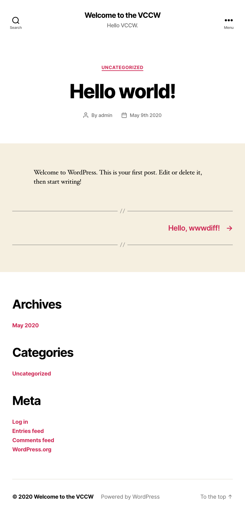
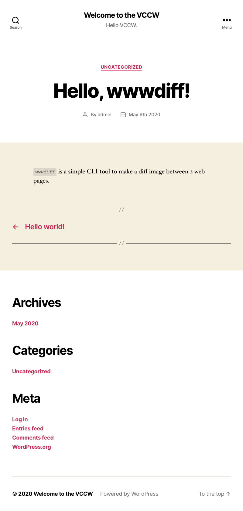
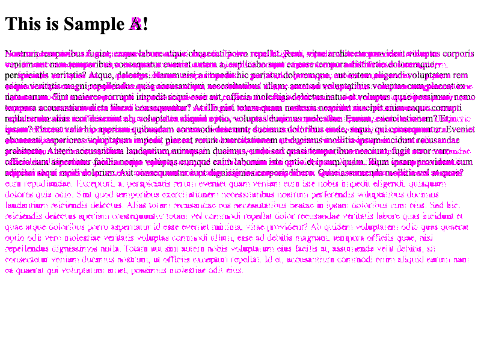

# wwwdiff


wwwdiff is a simple CLI tool to make a diff image between 2 web pages.

## Prerequisite

- Node.js > 10

## Usage

```shell
$ npm install -g wwwdiff
$ wwwdiff https://example.com/a https://examle.com/b > sample.png
```

Or you can use `wwwdfiff` via `npx`, perhaps it downloads Chromium browser (120MB) for every time.

```shell
$ npx wwwdiff https://example.com/a https://examle.com/b > sample.png
```

## Example

Example with 2 WordPress posts.

| Sample A                    | Sample B                    | Diff                              |
| :-------------------------- | :-------------------------- | :-------------------------------- |
|  |  |  |

## options

```shell
$ wwwdiff -h

  wwwdiff is a simple CLI tool to make a diff image between 2 web pages.

  Usage
    $ wwwdiff https://example.com/a https://example.com/b > example.png
  Options
    --color, -c <color>       hightlighting color. The default is #ff00ff.
    --delay, -d <millisecond> duration until shot. The default value is 0.
    --width, -w <width>       viewport width.
    --verbose                 shows debug messages.
```

You can simply take single screenshot with one URL argument.

```shell
$ wwwdiff https://example.com/a > example.png
```
